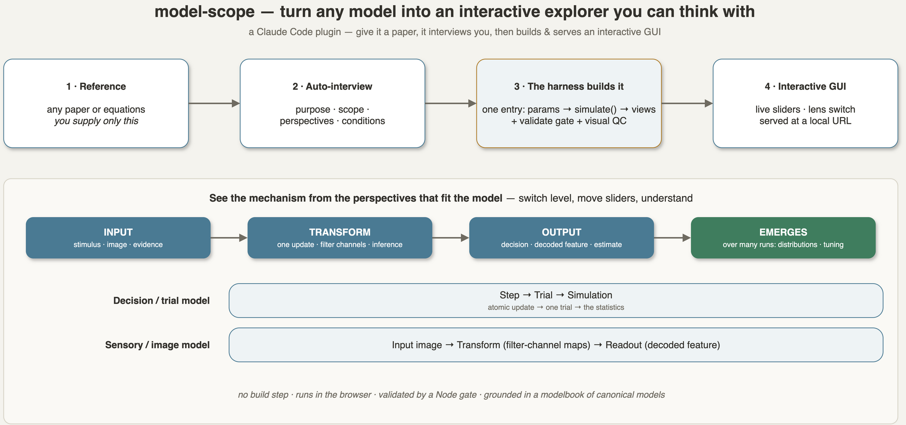
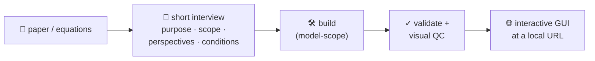
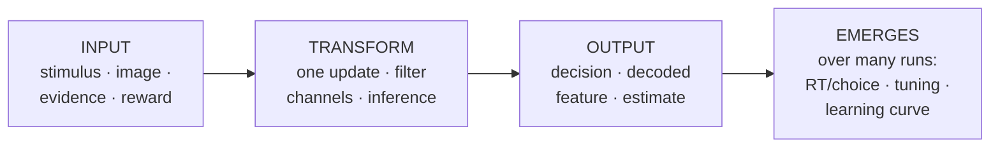
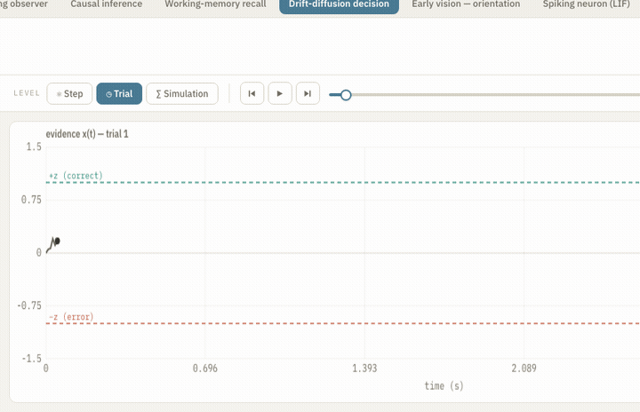
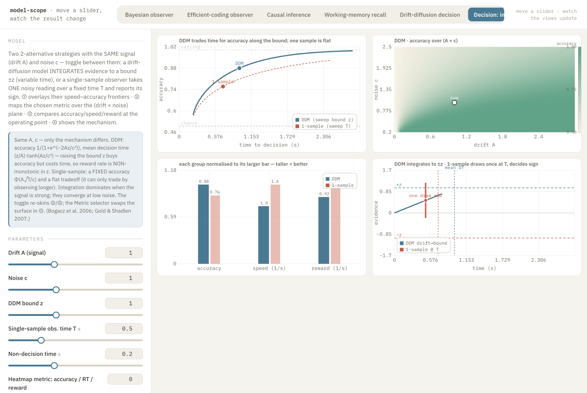
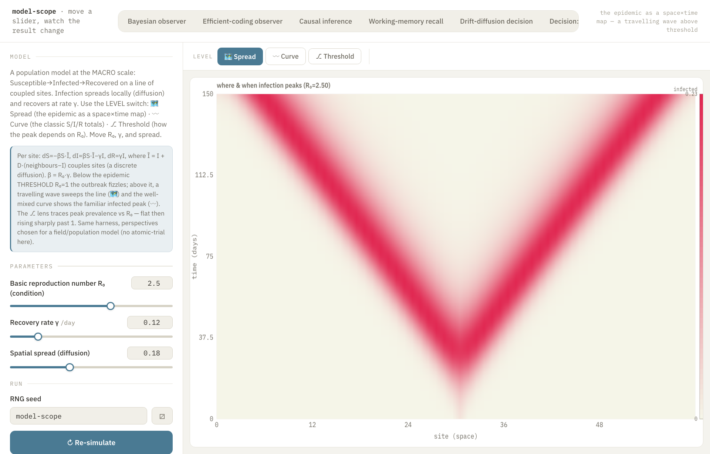
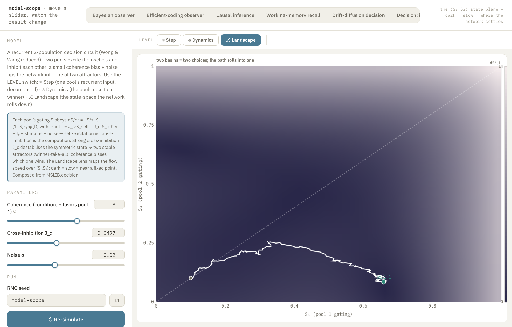
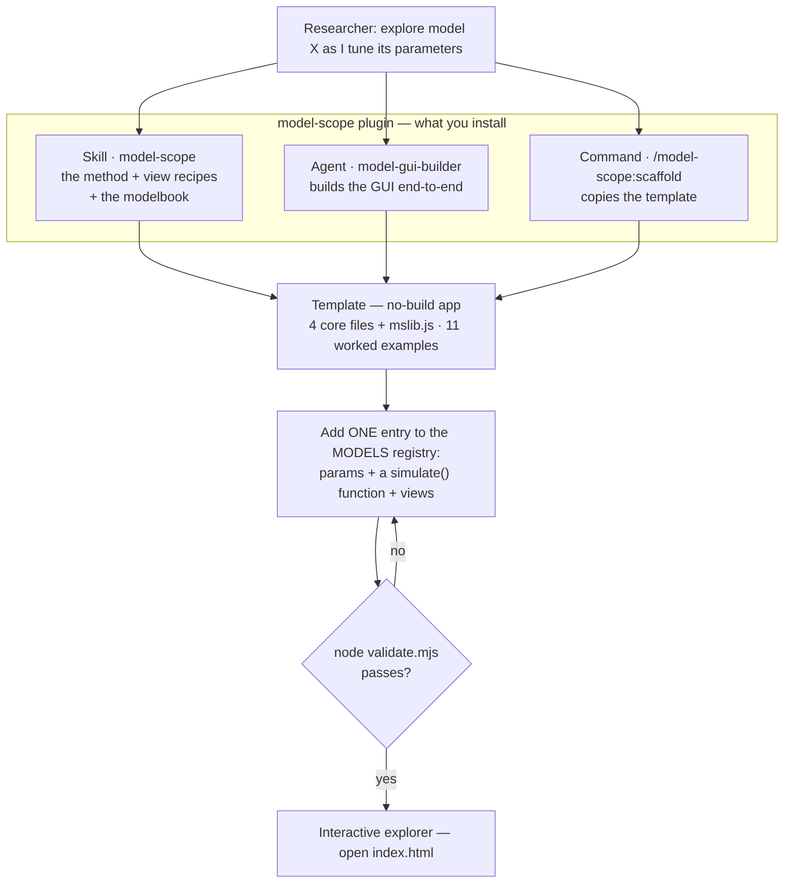
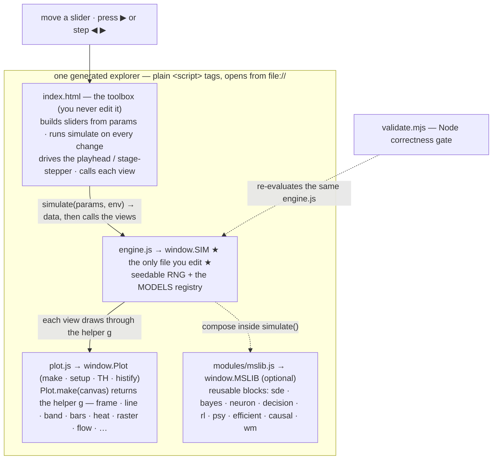

# model-scope

**Turn any parameterised model into an interactive explorer you can think with.**



`model-scope` is a [Claude Code](https://docs.claude.com/en/docs/claude-code) marketplace
plugin that builds a self-contained web app for *your* model: one slider per parameter (an
integer parameter acts as a discrete condition selector), and the simulation re-runs live —
shown in views the **model itself defines**. There is no fixed graphic and no fixed axis.
Move a slider, watch the result move, and build intuition by play instead of by re-reading
the equations.

> A **Bayesian observer** draws prior · likelihood · posterior and a central-tendency curve.
> A **leaky integrate-and-fire neuron** draws a *V(t)* trace, a spike raster, and an *f–I* curve.
> A **drift-diffusion** model animates an evidence trajectory and a response-time histogram.
> A **causal-inference**, **working-memory**, **RL**, **POMDP**, **saccade**, or
> **population** model draws whatever makes *it* intuitive.

It is built for researchers in perception, decision-making, learning, memory, and
single-neuron dynamics who want to *understand* a model by tuning it.

---

## How it works

**The easy way — hand it a paper.** You give *only* the reference; it interviews you briefly, then
builds and serves the GUI:



**What you get — one model, several perspectives.** The point isn't to copy a figure; it's to *see
the mechanism*: what the **input** is, what **transforms** it, what comes **out**, and what
**emerges** over many runs. A **level switch** lets you zoom each perspective, and every slider is
live, so you understand the model by playing with it:



The lenses adapt to the model class: a decision/trial model zooms **⚛ Step → ◷ Trial →
∑ Simulation**; a sensory/image model zooms **🖼 Input → 🧱 Transform → 🎯 Readout**. (See
[the perspectives catalogue](skills/model-scope/references/levels.md).)

---

## At a glance

- **Hand it a paper, get a simulator.** `/model-scope:from-paper <paper>` reads the reference,
  **interviews** you about the visualisation purpose and what you want (purpose · scope · which
  levels · which conditions), then builds the GUI and **starts a verified local URL** — with an
  optional shareable tunnel or permanent deploy when the tooling's available. You only supply the
  reference material.
- **Decompose the process, don't reproduce the figure.** Show *input → transformation → output* at
  three zoom levels — ⚛ Step (one atomic update) · ◷ Trial · ∑ Simulation — via a level switch.
- **Bring your own equations.** Adding a model is *one* declarative entry —
  `params` + `simulate() → data` + `views[]`. The sliders, the animation transport, and
  the redraw loop are generated for you; you never wire up a control by hand.
- **The model picks the picture.** Each view sets its own axes and draws whatever is
  intuitive: distributions, tuning / psychometric curves, rasters, phase portraits,
  energy landscapes, belief simplices, learning curves.
- **Switch perspective, not just play.** A **level switch** zooms one model between the
  perspectives that fit it — ⚛ Step · ◷ Trial · ∑ Simulation for a decision model, 🖼 Input ·
  🧱 Transform · 🎯 Readout for an image model — each driven by a *continuous* playhead **or** a
  *process-mode* ◀ ▶ stepper that walks an internal pipeline stage by stage.
- **No build step, no `npm install`, runs from `file://`.** Plain `<script>` tags — open
  `index.html`, or read the source top to bottom (the UI font is a webfont with a system
  fallback). The *same* `engine.js` is re-checked by a Node validation gate, so the math you
  read is the math that runs.
- **Readable by default.** The plotting helper carries the conventions that make a figure
  self-interpretable — axis labels with units, a colorbar on every heatmap, categorical ticks,
  legends that don't occlude data, and a **Text size** control that scales every label (handy for
  talks). It never mixes two units on one axis.
- **Grounded, not invented.** A *modelbook* of canonical families distilled from real
  open-source computational-neuroscience ecosystems, plus a small reusable code library
  (`mslib.js`) to compose from.

---

## What you can build — the examples that ship

The bundled template runs **eleven** worked models that **span the model scales** — behavioural /
process, single-neuron, sensory, network, and macro — across every idiom (a continuous playhead, a
process-mode stepper, and the perspective **level switch**):

| Model | Domain / scale | Idiom | What you watch |
|---|---|---|---|
| **Drift-diffusion decision** | decision-making | level switch (⚛◷∑) | ⚛ one update = drift + noise → new evidence · ◷ one trial walks to a bound · ∑ the RT histogram builds up — the worked 3-perspective example |
| **Decision: integrate vs one sample** | comparison | sliders + **toggle** | toggle two models; ① a speed–accuracy overlay · ② a metric **heatmap** over (drift × noise) · ③ accuracy/speed/reward **bars** · ④ the mechanism |
| **Early vision — orientation** | sensory / image | level switch (🖼🧱🎯) | 🖼 a noisy grating image · 🧱 oriented Gabor energy channels re-represent it · 🎯 the orientation tuning + decoded angle — an **image-input** model |
| **Attractor network — decision** | network | level switch (⚛◷⎇) | ⚛ one pool's recurrent input · ◷ the pools race (winner-take-all) · ⎇ the (S₁,S₂) energy **landscape** heatmap + trajectory |
| **Epidemic (spatial SIR)** | macro / population | level switch (🗺〰⎇) | 🗺 a space×time **kymograph** of a travelling infection wave · 〰 the S/I/R curves · ⎇ peak vs R₀ (the epidemic threshold) |
| **Spiking neuron (LIF)** | single-neuron biophysics | level switch (◷∑⌁) | ◷ a V(t) trace integrating to threshold · ∑ a spike raster over repeats · ⌁ the f–I transfer curve (+ a refractory **toggle**) |
| **Reinforcement learning (RW)** | learning | level switch (⚛◷∑) | ⚛ one Rescorla–Wagner update (δ = r − V) · ◷ the value learning curve · ∑ curves across learning rates α |
| **Bayesian observer** | perception / inference | continuous | prior · likelihood · posterior on a stimulus axis; an estimate-vs-true *central-tendency* curve (±SD ribbon); trial-to-trial prior updating |
| **Efficient-coding observer** — Wei & Stocker | perception | process mode | prior → warped encoding *F(θ)* → measurement → skewed likelihood → posterior → estimate → bias & discriminability |
| **Causal inference** — Körding et al. | multisensory | process mode | cues → per-hypothesis likelihoods → p(common cause) → branch estimates → combine, with the N-shaped ventriloquism bias |
| **Working-memory recall** — Bays & Husain | memory | process mode | allocate → encode on a feature wheel → probe → recall → error histogram → target / swap / guess decomposition |

Copy one, swap in your equations, and it is yours.

---

## A tour of the GUI

One harness, many control + view types — every plot is live, so you build intuition by tuning.

**Trial-level animation** — press ▶ and watch evidence accumulate to a bound (drift-diffusion, ◷ Trial lens):



<table>
<tr>
<td width="50%"><br/><b>Sliders + atomic step.</b> One update split into signal + noise; every parameter is a live slider (⚛ Step lens).</td>
<td width="50%"><br/><b>Colormaps + representation level.</b> An input image re-represented as oriented-filter energy maps (early vision, 🧱 Transform lens).</td>
</tr>
<tr>
<td width="50%"><br/><b>Toggles + condition sliders.</b> A boolean toggle (refractory on/off) beside sliders; the f–I transfer curve (LIF, ⌁ lens).</td>
<td width="50%"><br/><b>Spike raster.</b> Repeats stack into a raster with the mean firing rate (LIF neuron, ∑ Raster lens).</td>
</tr>
<tr>
<td width="50%"><br/><b>Multi-condition overlay + legend.</b> Learning curves across learning rates α (reinforcement learning, ∑ Rate-sweep lens).</td>
<td width="50%"><br/><b>Statistics over many trials.</b> The response-time histogram builds up, correct ↑ / error ↓ (drift-diffusion, ∑ Simulation lens).</td>
</tr>
<tr>
<td width="50%"><br/><b>Compare models via a toggle.</b> Switch DDM ⟷ single-sample; an overlay, a metric <b>heatmap</b> over (drift × noise), and accuracy/speed/reward <b>bars</b>.</td>
<td width="50%"><br/><b>Heatmap — a travelling wave.</b> A spatial SIR epidemic as a space×time kymograph (macro scale, 🗺 Spread lens).</td>
</tr>
<tr>
<td width="50%"><br/><b>Heatmap — an energy landscape.</b> A decision network's (S₁,S₂) flow field with the trajectory rolling into a basin (network scale, ⎇ Landscape lens).</td>
<td width="50%"><b>Same harness, any scale.</b> These heatmaps — a metric landscape, an epidemic kymograph, a phase-plane flow — all come from the same <code>g.heat</code> + <code>g.colorbar</code>; the eleven models span behavioural, single-neuron, sensory, network, and macro scales.</td>
</tr>
</table>

Every state is **deep-linkable** for sharing or screenshots: open `index.html?model=lif&lens=raster&head=30`
(`model` · `lens` · `head` · `still=1` · `text=`). The **Text size** control on the left rail scales
every label for talks.

---

## Architecture

There are two layers: the **plugin** you install (a skill, an agent, a command, a
template, and a modelbook) and the **explorer** it produces — a no-build app of four core
files (`index.html`, `engine.js`, `plot.js`, `validate.mjs`) plus an optional
reusable-model library, `mslib.js`, that the bundled examples use.

### From a model to a running explorer



### Inside a generated explorer



**The loop.** On any slider change the toolbox (debounced) calls `simulate(params, env)`
once, caches the returned `data`, then calls each view's `draw(g, data, ui)` to redraw. For
sequential models a `requestAnimationFrame` loop advances a playhead and redraws the views;
a generation counter cancels any in-flight playback, so rapid slider drags or model switches
never leave stale state on screen. You normally touch only `engine.js`.

---

## Why a harness — not just a prompt?

You *could* ask a chatbot "write me a simulator for model X" and paste the code back. That result
is a **one-off**: regenerated from scratch each time, unverified, and different on every run.
model-scope is a **harness** instead — it fixes the stable machinery and constrains each model to a
small, validated contract, so the unreliable part (an LLM writing code) is channelled into the one
place that *should* vary: the model's math and its views.

**What's fixed vs. what varies.** The toolbox (`index.html`), the plotting helper (`plot.js`), the
seedable RNG, the transport / lens UI, and the loading + QC machinery are all **fixed and reused**.
The only thing written per model is **one declarative `MODELS` entry** (`params` + `simulate()` +
`views`). There is far less surface to get wrong, and the plumbing can't regress because it is never
rewritten.

**How that structure buys reliability — versus asking a chatbot each time:**

| | ad-hoc "write me a simulator" | a model-scope harness |
|---|---|---|
| **Reproducibility** | non-deterministic; re-runs differ | a seedable per-trial RNG → same seed, same result; any trial is addressable by index |
| **Correctness** | rarely checked; errors ship silently | `node validate.mjs` re-runs the *same* `engine.js` the browser runs, plus analytic checks tied to the science, before it's "done" |
| **Separation of concerns** | math, UI, controls tangled in one blob | pure math (`engine.js`, no DOM) · rendering (`plot.js`) · toolbox (`index.html`) — edit one, the rest is already proven |
| **Consistency** | every request reinvents controls, axes, layout | every model gets the same sliders, readability conventions, perspectives, and QC for free |
| **Stable change** | adding a feature regenerates the whole app → fresh bugs | adding a model is one entry; the battle-tested toolbox is untouched |
| **Accumulation** | starts from zero each time | a *modelbook* of canonical families + a reusable `mslib.js` to compose from |
| **Bounded LLM** | free-form code, easy to hallucinate scaffolding | the skill/agent work *inside* the contract + the GUI-QC pipeline — freedom goes to the science, not the plumbing |

In short, a harness turns a stochastic code generator into a **dependable producer** by (1) fixing
the plumbing, (2) constraining output to a validated contract, (3) gating with deterministic checks,
and (4) accumulating reusable parts. It's the same reason engineers reach for a framework + tests
instead of hand-rolling every app: the variance is confined to one small, checked place.

---

## The model contract — add your own model in one entry

A model is a pure, DOM-free object you append to the `MODELS` registry in `engine.js`
(and its id to `MODEL_ORDER`):

```js
mymodel: {
  id:'mymodel', name:'My model',
  blurb:'one plain-language sentence', note:'a key qualitative effect to point out',
  params: [ {name:'sigma', label:'Noise σ', min:0.1, max:3, step:0.01, default:1, unit:'a.u.'}, … ],

  // Run the WHOLE simulation for these parameters and return ANY data the views need.
  // env = { rng, seed, params } — rng is seeded from the seed field, so runs are reproducible.
  simulate: (p, env) => { /* compute curves, samples, fields, sequences… */ return data; },

  // One or more panels; each draws its own axes & graphics via the helper g.
  views: [
    { title:'…', draw:(g, data, ui) => {
        g.frame({ x:[lo,hi], y:[lo,hi], xlabel, ylabel, title });   // YOUR axes
        g.line(pts); g.band(pts); g.bars(hist); g.vline(x); g.heat(…); g.raster(…);
        // ui = { head, playing, params, frac, stage, stageKey, stages, nStages } — read it to animate
    }},
  ],

  // OPTIONAL — choose ONE if the model is sequential:
  anim:   { length:(p,data)=> N },              // continuous playhead: ui.head ∈ [0,N]
  stages: (p,data)=> [ {key,name,about}, … ],   // process mode: a ◀ ▶ stage stepper
}
```

The control rail, the simulate-on-change loop, the transport, and the view grid are all
generated from this one entry — you never wire up a control or a redraw by hand. (A
histogram, like any graphic, is drawn inside a view with `g.bars` + `Plot.histify`.) Why
this shape works:

- **`simulate` returns whatever you want** — distributions, a tuning curve, sampled
  trajectories, a 2-D field, a trial-by-trial sequence. The views interpret it; this is
  what removes the fixed-graphic constraint.
- **`views` own their axes.** One view can be a density on a stimulus axis, the next an
  estimate-vs-true curve, the next a heatmap.
- **`anim` / `stages` are optional.** A static curve that depends only on parameters needs
  neither — it just redraws on slider change.

### The two animation idioms

| | `anim` — continuous | `stages` — process mode |
|---|---|---|
| **Transport** | play · pause · fast-forward · scrub | ◀ ▶ single-step + a stage-named readout |
| **Playhead** | `ui.head ∈ [0, length]` — a trial, a time, an iteration | `ui.stage = ⌊head⌋ ∈ [0, nStages−1]` — the current pipeline step |
| **Reach for it when** | trials accumulate, evidence drifts, a value updates | you want to *see each computation in sequence* |
| **Example** | drift-diffusion; the Bayesian observer's prior updating | the efficient-coding, causal-inference & working-memory pipelines |

### Decompose the process — the three levels (`lenses`)

The point isn't to pixel-match a paper's figure; it's to make the **mechanism** legible —
*given an input, what transformation produces what output* — decomposed to the **atomic level**.
A model can declare `lenses` and the toolbox shows a **level switch** that zooms the same
simulation three ways: **⚛ Step** (ONE update split into its contributions — signal, leak/decay,
noise — → the new state), **◷ Trial** (that atom repeated over time → an output), **∑ Simulation**
(many trials → the statistics you'd compare to data). The template's **drift-diffusion** model is
the worked exemplar; see [`references/levels.md`](skills/model-scope/references/levels.md).

### Scaling to a whole paper — screens, conditions, a claim map

A whole paper isn't one grid: each entry in `MODEL_ORDER` is a **top tab (a screen)**, so you
build the paper as a few screens that tell the story in order — **mechanism** (one trial: where
input accumulates and decays) → **condition comparisons** (sweep one experimental condition at
fixed model parameters) → the **key prediction**. Keep **experimental conditions** (swept across
fixed levels) separate from **model parameters** (sliders), and make the paper's
**claim↔mechanism** mapping visible — show *why* the data look that way rather than re-plotting
the figure. Heavy comparison screens stream their trials via `SIM.runChunks` behind a loading
overlay. See the skill's "Scaling to a whole paper" and [`references/gui-qc.md`](skills/model-scope/references/gui-qc.md).

See [`references/plotting.md`](skills/model-scope/references/plotting.md) for the full `g`
API and worked view recipes,
[`references/architecture.md`](skills/model-scope/references/architecture.md) for the model
contract and runtime, and [`references/gui-qc.md`](skills/model-scope/references/gui-qc.md) for
the GUI QC pipeline (static gate + visual checklist + two-axis review) every build passes.

---

## Install

From inside Claude Code, once the repo is on GitHub:

```
/plugin marketplace add Joonoh991119/model-scope
/plugin install model-scope@joonoh-modeling
```

Or from a local clone — point the marketplace at the cloned folder (a path relative to your
Claude Code working directory, or an absolute path):

```bash
git clone https://github.com/Joonoh991119/model-scope
```
```
/plugin marketplace add ./model-scope          # or an absolute path to the clone
/plugin install model-scope@joonoh-modeling
```

## Use

**Hand it a paper (the autonomous flow).** Give it *only* the reference material — it interviews
you about what you want, then builds the GUI and starts a verified local URL, with an optional
shareable tunnel or permanent deploy when the tooling is available:

```
/model-scope:from-paper ./furman-wang-2008.pdf
```

The `paper-to-sim` skill reads the reference, runs a short `AskUserQuestion` interview (purpose ·
scope · which levels ⚛◷∑ · which conditions · constraints) with defaults drawn from the paper,
then drives the build + QC and verifies the local URL before reporting it. It
also triggers on plain language — *“turn this paper into an interactive sim”*, *“interview me and
build a simulator from these equations.”*

**Or describe a model directly.** The `model-scope` skill triggers and the `model-gui-builder`
agent can take it end to end:

> *“Build me a GUI to explore a leaky integrate-and-fire neuron as I vary the input current
> and the noise.”*

To start from the template by hand:

```
/model-scope:scaffold ./my-sim "a leaky integrate-and-fire neuron"
```

Then `cd ./my-sim`, run `node validate.mjs` to check it, and open `index.html` to use it.

---

## The modelbook — canonical model families

Don't invent a model from scratch when a canonical family fits.
[`references/modelbook/`](skills/model-scope/references/modelbook/INDEX.md) is a curated,
extensible catalogue: for each family it gives the canonical equations, parameters with
their meaning and typical ranges, the views that make it intuitive, a ready-to-compose
`MSLIB` code module, and source pointers.

| Family | Use it for | `MSLIB` |
|---|---|---|
| **Bayesian / ideal observer** | perception, magnitude & time estimation, central tendency, prior learning | `bayes` |
| **Efficient coding & sequential observers** | prior-shaped encoding, repulsive/anti-Bayesian bias, bias ↔ discriminability | `efficient`, `bayes` |
| **Causal inference & Bayesian cognition** | multisensory fusion, ventriloquism, cue combination, concept learning | `causal` |
| **Working memory & mixture models** | continuous report, precision / capacity, swap errors, von Mises mixtures | `wm` |
| **Evidence accumulation & attractor decision** | 2AFC decisions, RT distributions, speed–accuracy, winner-take-all | `decision`, `sde` |
| **Single neurons & small networks** | membrane dynamics, *f–I* curves, spike trains, gain | `neuron` |
| **Reinforcement learning & belief update** | value learning, choice, volatility, prior updating | `rl` |
| **Psychometrics & detection** | psychometric curves, SDT, thresholds, scalar timing | `psy` |

These are **recipes, not prescriptions** — start from a family, then adapt it to your exact
equations and compose the small `MSLIB` functions rather than copying a whole repo. The
families are distilled from named open-source ecosystems for grounding and deeper
reference: Acerbi lab (observer modelling + PyVBMC / PyBADS / PyIBS fitting), Wang lab
(the reduced Wong–Wang decision circuit), Gardner lab (psychophysics, the normalization
model of attention), Stocker & Wei Ji Ma labs (efficient-coding observers), Körding & Shams
labs (Bayesian causal inference, `bcitoolbox`), Bays lab / MemToolbox (working-memory
mixtures), and Brian2 / *Neuronal Dynamics* / Neuromatch (canonical neuron models).

---

## Validation & reproducibility

- **Math implemented as given.** The method's rule is to transcribe the equations exactly,
  never re-derive them from memory, and to *state* any discretisation bias (e.g. an Euler
  step's `O(√Δt)` boundary bias) rather than hide it.
- **Reproducible.** A seedable RNG makes every run deterministic; trial-based models seed
  each trial independently as `trialRng(seed, k)`, so the player can jump straight to trial *k*.
- **Validated.** `validate.mjs` re-evaluates the *same* `engine.js` the browser runs and
  checks that every model's `simulate()` returns sane data and every view is a function,
  plus a per-model analytic check where one exists — a Bayesian reliability weight in
  (0, 1), and a drift-diffusion error rate within tolerance of the closed form
  `1/(1 + e^{2Az/c²})`. It then sanity-checks the `mslib.js` building blocks (an *f–I* curve
  that increases monotonically, a Wong–Wang unit winning at positive coherence,
  Rescorla–Wagner converging, and more). It must pass before a model is "done".
- **GUI QC pipeline.** Beyond the static gate, every build walks
  [`references/gui-qc.md`](skills/model-scope/references/gui-qc.md): a **visual checklist**
  (no clipped/overlapping text, ceiling/chance reference lines, accuracy clamped to `[chance,1]`,
  units on every axis, legends off the data, a colorbar on every heatmap, a loading overlay on
  heavy screens) and a **two-axis review pass** (scientific-plot readability + concept clarity) —
  fix and re-verify.

```bash
node skills/model-scope/assets/template/validate.mjs   # → ✓ ALL CHECKS PASSED
```

---

## Repository layout

```
model-scope/
├── .claude-plugin/              plugin.json + marketplace.json (the repo root is both)
├── agents/
│   └── model-gui-builder.md     the subagent that builds an explorer end-to-end
├── commands/
│   ├── scaffold.md              /model-scope:scaffold <dir> [model idea]
│   └── from-paper.md            /model-scope:from-paper <paper> — interview → build → serve
├── skills/paper-to-sim/
│   └── SKILL.md                 the autonomous flow: ingest reference → interview → build → serve
└── skills/model-scope/
    ├── SKILL.md                 the method (auto-loaded when you ask to build a model GUI)
    ├── references/
    │   ├── architecture.md      the model contract + runtime, in detail
    │   ├── plotting.md          the g API + view recipes + readability conventions
    │   ├── levels.md            the three-level (step·trial·simulation) method + atomic-step recipe
    │   ├── gui-qc.md            the QC pipeline: static gate + visual checklist + review
    │   └── modelbook/           one file per canonical family + INDEX.md
    └── assets/template/         the app you copy & extend
        ├── README.md            quick-start for the copied app
        ├── index.html           the toolbox — sliders, the loop, the transport (untouched)
        ├── engine.js            seedable RNG + the MODELS registry   ← you edit this
        ├── plot.js              the canvas charting helper g
        ├── modules/mslib.js     optional reusable model library (MSLIB)
        └── validate.mjs         the Node correctness gate
```

---

## Design lineage

The pattern was distilled from a full DDM/TAFC decision simulator (the *Decision Lab*,
after Bogacz, Brown, Moehlis, Holmes & Cohen, 2006): a seedable per-trial RNG for instant,
reproducible, addressable trials; a trial-by-trial player (restart · play · fast-forward ·
scrub); fixed-axis, Δt-aligned histograms; and a rank-equalised energy-landscape colour map
(yellow = attractor / valley, blue = ridge) for 2-D models with a bifurcation. `model-scope`
generalises that one app into a builder for *any* model — see the skill for the full rationale.

---

MIT licensed · © Joonoh Park ([joonop99@snu.ac.kr](mailto:joonop99@snu.ac.kr))
